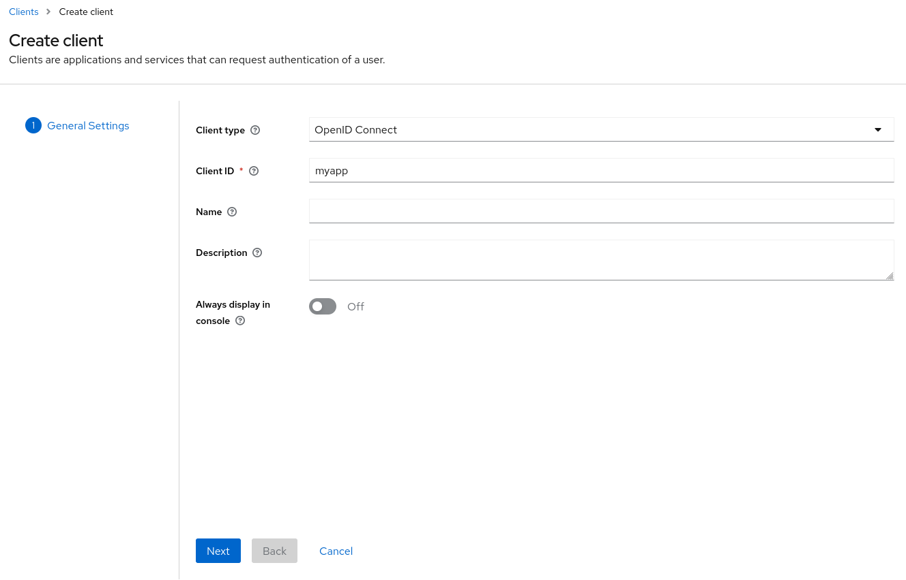
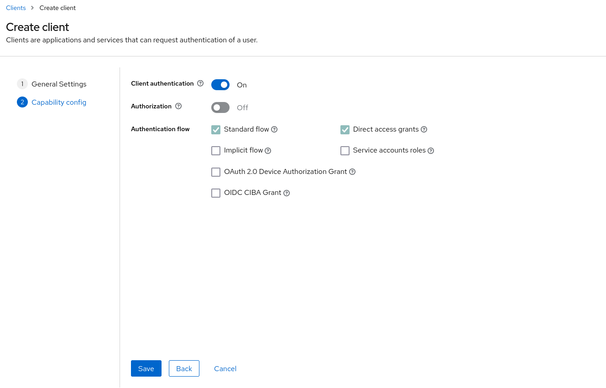
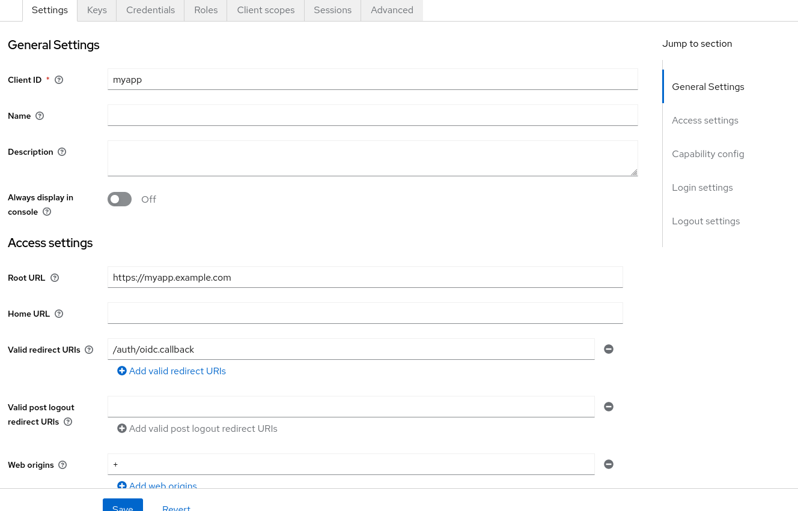

# Keycloak

## Setup an OpenID Connect client

Please see below a standard setup if you need to add OpenID connect with some services deployed in this project.

> Keycloak recommends to [choose another realm than master](https://www.keycloak.org/docs/latest/server_admin/#the-master-realm).
---
- Go to the desired realm
- Go to `Clients` -> `Create Client`
- Fill up `Client ID` field, click on next.
  
---
- Switch `Client Authentification` to `On` and leave `Standard Flow` and `Direct Access Grant` checked, then click on save.
  
---
- Fill up `Root URL` with the url of your service (ex: https://myservice.example.com)
- Fill up `Valid redirect URIs`, if you know the exact relative callback url use it (ex: `/auth/oidc.callback`), otherwise you can add a `*` which will allow any url from your app domain
- Fill up `Web origins` and set it to `+` which will permit all origins of Valid Redirect URIs.
  
- You can leave the rest to default settings
- Click on save
---
- Go to the credentials tab and get your client secret